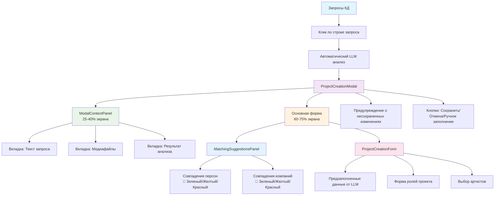

# День 13.1: Новый UX Workflow - Диаграмма архитектуры

## Архитектура нового пользовательского интерфейса

## Ключевые улучшения

### 1. **Полноэкранное модальное окно**
- Адаптивная панель контекста (25-40% экрана)
- Основная форма (60-75% экрана)
- Современные анимации и переходы

### 2. **Автоматический LLM анализ**
- При клике на запрос запускается анализ
- Результаты отображаются в контекстной панели
- Предзаполнение формы данными от ИИ

### 3. **Панель совпадений с цветовыми индикаторами**
- 🟢 Зеленый: Высокая уверенность (≥80%)
- 🟡 Желтый: Средняя уверенность (60-79%)
- 🔴 Красный: Низкая уверенность (<60%)

### 4. **Адаптивный дизайн**
- Мобильные устройства: вертикальная компоновка
- Планшеты: гибридная компоновка
- Десктоп: горизонтальная компоновка

### 5. **Современные анимации**
- Плавные переходы между вкладками
- Анимированные списки совпадений
- Hover эффекты и тени

## Компоненты

### Frontend
- `ProjectCreationModal` - полноэкранное модальное окно
- `ModalContextPanel` - адаптивная панель с контекстом
- `MatchingSuggestionsPanel` - панель совпадений с индикаторами
- `ProjectCreationForm` - интегрированная форма создания проекта
- `RequestsTable` - обновленная таблица с кликом по строке

### Backend
- API для автоматического анализа запросов
- Кэширование результатов анализа (5 минут)
- Интеграция поиска совпадений

## Тестирование

### ✅ Выполнено
- Создание всех новых компонентов
- Интеграция с существующими сервисами
- Адаптивный дизайн для всех устройств
- Современные анимации и переходы
- Предупреждения о несохраненных изменениях

### 🔄 В процессе
- Тестирование в браузере
- Проверка всех пользовательских сценариев

## Результат

Новый UX workflow кардинально улучшает пользовательский опыт:
- Убраны кнопки из таблицы - теперь клик по строке
- Автоматический анализ при открытии модального окна
- Полноэкранное модальное окно с адаптивной панелью
- Цветовые индикаторы совпадений
- Современные анимации и переходы
- Полная адаптивность под все устройства
